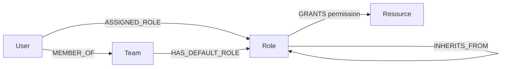

# Enterprise Access Lineage Graph

A tool for auditing **who can access what, through which path** — built on CognoDB
(openCypher over Bolt) as the graph layer, a Spring Boot API, and a React frontend
styled as a technical "clearance dossier."

> Built as a take-home assignment for Wexa AI. The full brief is in the assignment
> document; this README covers the "Why a graph database?", data model, setup, and
> query walkthrough it asks for.

**Live demo:** `https://permission-access-lineage-graph.vercel.app`
**Screen recording:** `<link here>`

---

## Why a graph database?

Access control in a real organization rarely comes from one place. A person might
have access **directly assigned** to them, *and* **inherited through a team's
default role**, *and* those roles might themselves **inherit from other roles**
underneath them. The question an access audit actually needs answered is:

> "If I revoke this specific role from this specific person, what do they *really*
> lose — accounting for everything else that still covers them?"

In a relational schema, answering that means walking two separate recursive
hierarchies (direct-role inheritance and team-role inheritance) and then computing
a set difference between them — typically two recursive CTEs plus an anti-join,
and it gets worse the moment a third access path (e.g. project-based sharing) is
added. In a graph, it's a natural traversal: walk outward from the user along
every path, and diff the sets.

This app's centerpiece query does exactly that — see [Query 2](#query-2--simulate-revoke-the-centerpiece-query) below — and it generalizes to revoking
*any combination* of direct and team-inherited roles at once, not just one.

---

## Data model



| Node | Key properties |
|---|---|
| `User` | `id`, `name`, `email` |
| `Team` | `id`, `name` |
| `Role` | `id`, `name`, `level` |
| `Resource` | `id`, `name`, `type` (Document, Database, Repo, Dashboard, API, Bucket, Pipeline, Spreadsheet) |

Roles aren't a single ladder. The main chain is
`Viewer → Contributor → Editor → Admin → SecurityLead`, but `Auditor`,
`LegalCounsel`, and `OnCallResponder` branch laterally off `Viewer`, each
unlocking a specific resource class without climbing the main privilege ladder.

Full design notes, including every deliberate edge case in the seed data (a
zero-access user, a user with two direct roles at once, a user whose direct role
is fully redundant with their team default, etc.) are in
[`docs/data-model.md`](docs/data-model.md).

---

## Features

- **Access diagram** — a blueprint-style schematic per user: solid lines for
  direct role assignments, dashed lines for team-inherited access, radiating out
  to the resources each role unlocks.
- **Dossier panel** — the same information as a readable list, with a badge on
  every resource showing exactly which path(s) reach it.
- **Multi-source revoke simulation** — select any combination of direct and
  team-inherited roles and see exactly what's actually lost vs. retained through
  whatever wasn't selected. The diagram animates the diff live.
- **Graceful degradation** — if CognoDB is unreachable, the API returns a clean
  503 and the UI shows an explicit error state rather than a blank screen or a
  stack trace.

---

## Tech stack

| Layer | Technology |
|---|---|
| Database | CognoDB (openCypher / Bolt 5.x) |
| Backend | Java 17, Spring Boot 3, official Neo4j Java driver (raw parameterized Cypher, no ORM) |
| Frontend | React 18 (Vite), plain CSS with design tokens, no UI framework |
| Seed data | Node.js script using the official Neo4j JS driver |

---

## Project structure

```
access-graph/
├── backend/                  Spring Boot API
│   ├── src/main/java/ai/wexa/accessgraph/
│   │   ├── config/            CognoDB driver bean, CORS config
│   │   ├── controller/        REST endpoints, error handling
│   │   ├── service/           Query orchestration, Cypher file loading
│   │   └── dto/                Response shapes
│   ├── src/main/resources/cypher/   The 5 Cypher queries, as standalone files
│   ├── Dockerfile
│   └── pom.xml
├── frontend/                 React app (Vite)
│   └── src/
│       ├── components/        Roster, GraphSchematic, Dossier, RevokeSimulator
│       ├── api.js             Backend API client
│       └── styles.css / tokens.css
├── scripts/
│   ├── seed.js                 Loads the seed dataset into CognoDB
│   └── queries/                 Copies of the same Cypher queries, for manual testing
├── docs/
│   └── data-model.md            Full data model + seed-data scenario notes
└── .gitignore
```

---

## Setup & run instructions

### 1. Create a CognoDB instance

1. Sign up at [console.cognodb.com/signup](https://console.cognodb.com/signup) — no credit card required.
2. Create a free (`c0`) instance and pick a region. Provisioning takes under a minute.
3. Copy the connection URI (`bolt+s://<instance-id>.databases.cognodb.cloud`) and the
   generated password for the `cognodb` user — the password is shown **once**.

### 2. Seed the database

```bash
cd scripts
cp .env.example .env
# edit .env with your COGNODB_URI, COGNODB_USER=cognodb, COGNODB_PASSWORD
npm install
node seed.js
```

This loads 20 users, 8 teams, 8 roles, and 15 resources across 8 resource types,
with deliberately varied access patterns per user (see
[`docs/data-model.md`](docs/data-model.md) for the full scenario table).

### 3. Run the backend

```bash
cd backend
export COGNODB_URI="bolt+s://<your-instance-id>.databases.cognodb.cloud"
export COGNODB_USER="cognodb"
export COGNODB_PASSWORD="<your-password>"
mvn clean spring-boot:run
```

Verify it's connected:
```bash
curl http://localhost:8080/api/users
```

### 4. Run the frontend

```bash
cd frontend
cp .env.example .env   # VITE_API_BASE_URL=http://localhost:8080
npm install
npm run dev
```

Open the URL Vite prints (typically `http://localhost:5173`).

---

## API reference

| Method | Path | Description |
|---|---|---|
| `GET` | `/api/users` | List all users (roster) |
| `GET` | `/api/users/{userId}/access` | Everything a user can reach, and via which path(s) |
| `GET` | `/api/users/{userId}/access-sources` | Every selectable access source (direct + team-inherited) for the revoke UI |
| `GET` | `/api/users/{userId}/roles` | A user's directly-assigned roles only |
| `GET` | `/api/users/{userId}/simulate-revoke?source=...&source=...` | Simulate revoking one or more access sources at once |

All queries are parameterized via the official Neo4j driver's parameter map —
no string-concatenated Cypher anywhere in the codebase.

---

## The main queries, explained

The full text of every query lives in `backend/src/main/resources/cypher/` (and
is mirrored in `scripts/queries/` for pasting directly into the CognoDB console).

### Query 1 — Resolve user access

Walks both access paths independently — direct role assignment, and
team-membership → team's default role — through up to 5 levels of role
inheritance, out to every `GRANTS` edge. Returns each resource with every
distinct path that reaches it, so a resource reachable through two overlapping
paths shows both.

### Query 2 — Simulate revoke (the centerpiece query)

Takes a list of access sources to revoke (any mix of direct roles and specific
team-inherited roles). For every resource reachable via a revoked source, it
checks whether that resource is *also* reachable via a source that wasn't
selected — if so, it's `retainedAnyway`; if not, it's `actuallyLost`.

This is the query that's genuinely awkward in SQL: it requires independently
traversing an arbitrary-length list of inheritance chains, tagging each by
whether it was selected for revocation, then computing a set difference across
the whole result — in SQL, a recursive CTE per chain plus an anti-join, with
complexity growing for every additional selected source. In Cypher, it's two
correlated subqueries, a list concatenation, and a filter.

### Queries 3–5 — Supporting lookups

List users for the roster, a user's direct roles, and a user's full set of
selectable access sources (used to populate the revoke-simulation checkboxes).

---

## Deployment

- **Backend**: deployed on [Render](https://render.com) via the `backend/Dockerfile`
  (multi-stage Maven build → slim JRE runtime image). Environment variables:
  `COGNODB_URI`, `COGNODB_USER`, `COGNODB_PASSWORD`, `ALLOWED_ORIGINS`.
- **Frontend**: deployed on [Vercel](https://vercel.com), root directory `frontend`,
  environment variable `VITE_API_BASE_URL` pointing at the Render backend URL.

Note: Render's free tier spins down after inactivity, so the first request after
a period of idleness may take 30–50 seconds to wake up.

---

## Known limitations / possible extensions

- Access sources are currently direct-role and team-role only. A natural third
  path — project-based sharing (`(:User)-[:CONTRIBUTES_TO]->(:Project)-[:GRANTS_PROJECT_ACCESS]->(:Resource)`)
  — would make the multi-path story even stronger and is a straightforward
  extension of the existing model.
- No authentication on the API itself (out of scope for this assignment, but
  would be the first thing added for real use).
- Role inheritance traversal is capped at depth 5 as a defensive guard against
  accidental cycles; the seed data has no cycles.
